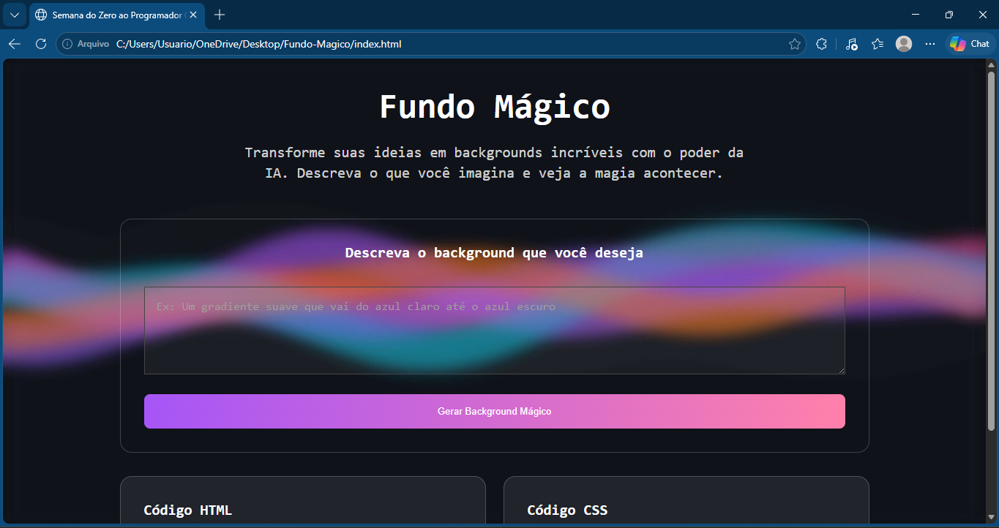
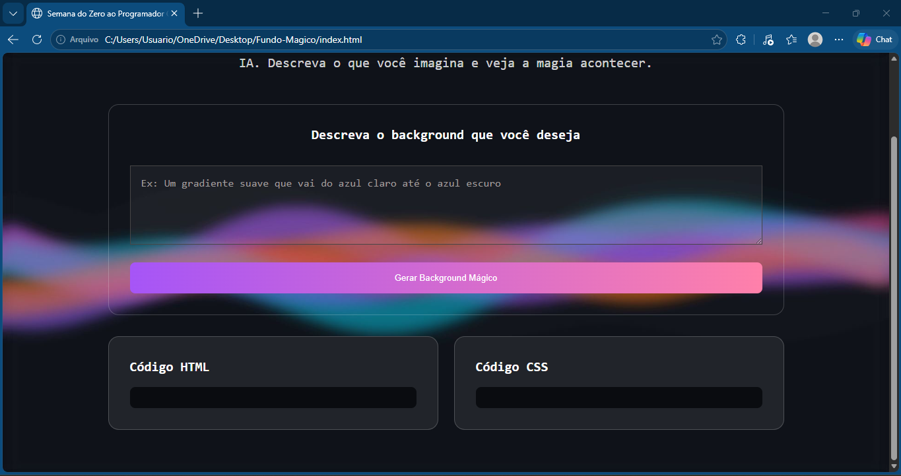
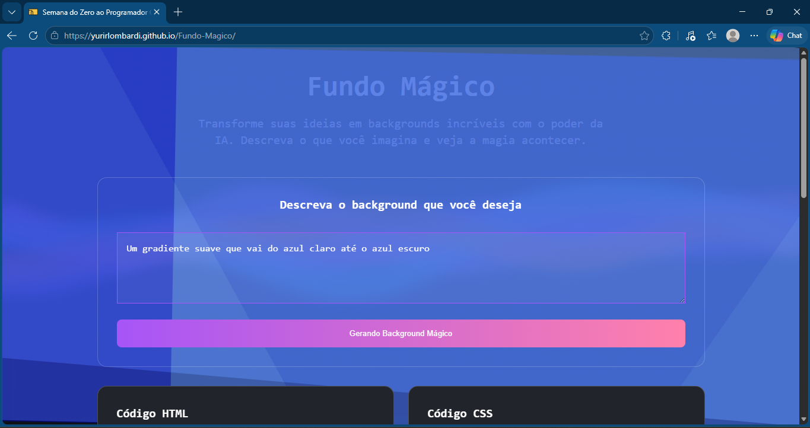
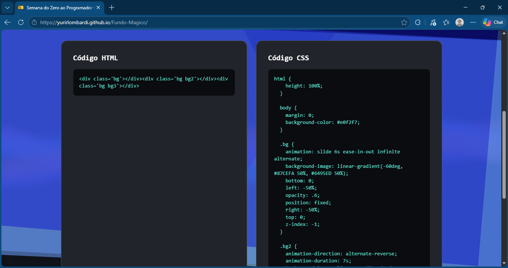
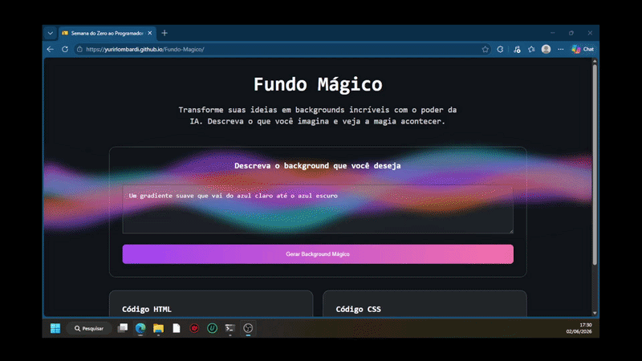

# 🎨 Fundo Mágico
 
Aplicação web que gera backgrounds dinâmicos e animados utilizando Inteligência Artificial, desenvolvida com HTML5, CSS3 e JavaScript. O sistema recebe uma descrição textual do usuário, envia para uma automação n8n integrada ao Google Gemini e retorna o código HTML/CSS do background gerado, aplicando-o dinamicamente na página.
 
> Projeto desenvolvido durante a Semana do Zero ao Programador Contratado, com foco na aplicação de conceitos de semântica HTML, responsividade, manipulação de DOM e integração com automação via n8n e IA generativa.
 
---
 
## 📸 Demonstração
 
### 🏠 Tela
 

 
---
 
### ✍️ Descrevendo o Background
 

 
---
 
### ⏳ Gerando o Background
 

 
---
 
### 🎨 Background e Código Gerados pela IA
 


---

### 🎥 Demonstração da Aplicação
 

 
---
 
## 🎯 Objetivo
 
O projeto foi desenvolvido com o objetivo de criar uma interface web capaz de gerar backgrounds personalizados com base em descrições em linguagem natural, aplicando conceitos de integração com APIs, automação de fluxos com n8n e uso de modelos de linguagem para geração de código CSS/HTML dinâmico.
 
---
 
## ⚙️ Funcionalidades
 
- Geração de backgrounds dinâmicos e animados via IA
- Integração com automação n8n usando o modelo Google Gemini
- Exibição do código HTML e CSS gerado pela IA
- Preview em tempo real do background gerado
- Aplicação dinâmica do CSS retornado na página
- Interface responsiva e com indicador de carregamento
- Manipulação de DOM via JavaScript puro
---
 
## 🛠️ Tecnologias Utilizadas
 
- HTML5
- CSS3
- JavaScript (ES6+)
- n8n (automação de fluxos)
- Google Gemini (modelo de linguagem generativo)
---
 
## 🧠 Conceitos Aplicados
 
- Semântica HTML5
- Responsividade e layout flexível
- Manipulação de DOM
- Requisições HTTP assíncronas com `fetch` e `async/await`
- Integração com webhooks e APIs externas
- Automação de fluxos com n8n
- Uso de IA generativa para geração de código
- Injeção dinâmica de estilos no documento
---
 
## 📂 Estrutura do Projeto
 
```plaintext
/Fundo-Magico
│
├── index.html
└── src/
    ├── css/
    │   ├── reset.css
    │   ├── estilo.css
    │   └── responsivo.css
    ├── js/
    │   └── index.js
    └── images/
        └── bg.JPG
```
 
---
 
## 🔄 Como Funciona
 
| Etapa | Descrição |
|---|---|
| 1. Entrada | Usuário descreve o background desejado em linguagem natural |
| 2. Requisição | O JavaScript envia um `POST` para o webhook do n8n com a descrição |
| 3. Automação | O n8n processa a entrada usando o Google Gemini Chat Model |
| 4. Resposta | A IA retorna um JSON com os campos `html` e `css` do background |
| 5. Exibição | O código é exibido na tela e o CSS é aplicado dinamicamente à página |
 
---
 
## 🚀 Execução do Projeto
 
### 1️⃣ Clone o repositório
 
```bash
git clone <URL_DO_REPOSITORIO>
```
 
---
 
### 2️⃣ Configure o webhook n8n
 
O arquivo `src/js/index.js` realiza uma requisição `POST` para um webhook do n8n. Para utilizar o projeto com sua própria automação:
 
- Crie um fluxo no [n8n](https://n8n.io/) com um nó Webhook (trigger) e um nó do Google Gemini Chat Model
- Substitua a URL do webhook no arquivo `src/js/index.js`:
```javascript
const response = await fetch("SUA_URL_DO_WEBHOOK_AQUI", {
    method: "POST",
    headers: { "Content-Type": "application/json" },
    body: JSON.stringify({ descriptionValue }),
});
```
 
- Certifique-se de que a automação retorne um JSON no formato:
```json
{
  "html": "<div>...</div>",
  "css": "body { background: ...; }"
}
```
 
---
 
### 3️⃣ Abra o projeto
 
Abra o arquivo `index.html` diretamente no navegador ou utilize uma extensão como o **Live Server** no VS Code para uma melhor experiência de desenvolvimento.
 
---
 
## 📈 Melhorias Futuras
 
- Histórico de backgrounds gerados
- Opção para download do código gerado
- Botão para copiar o código HTML/CSS com um clique
- Suporte a outros modelos de IA além do Google Gemini
- Galeria pública de backgrounds criados pela comunidade
- Melhorias de acessibilidade (ARIA, contraste)
---
 
## 👨‍💻 Autor
 
Yuri Rodrigues Lombardi
 
🔗 LinkedIn: https://linkedin.com/in/yuri-rodrigues-lombardi
💻 GitHub: https://github.com/yuriRLombardi
